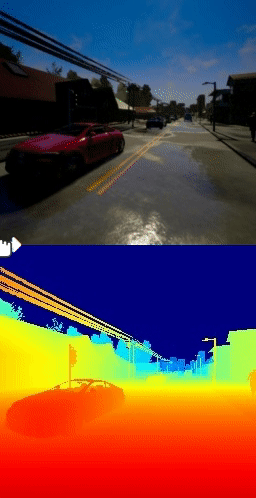

# DynaFill
[Project](http://inpainting.cs.uni-freiburg.de/) | [arXiv](https://arxiv.org/abs/2008.05058)  
Borna Bešić, Abhinav Valada  
_Dynamic Object Removal and Spatio-Temporal RGB-D Inpainting via Geometry-Aware Adversarial Learning_



## Setting Up the Environment
We recommend using [conda](https://docs.conda.io/en/latest/) package and environment management system. We provide [`environment.yml`](environment.yml) that can be used to easily create a self-contained environment with all the dependencies:
```sh
conda env create -f environment.yml
conda activate DynaFill
```
#### Tested Configuration
- Linux 4.15.0-122-generic x86_64
- NVIDIA GPU Driver 390.138 + CUDA 9.0
- Python 3.6
- PyTorch 1.1.0 + torchvision 0.2.1
- OpenCV 4.0

## Dataset
The description of our DynaFill dataset with the corresponding download instructions can be found at [inpainting.cs.uni-freiburg.de/#dataset](http://inpainting.cs.uni-freiburg.de/#dataset).

## Running the Demo

```sh
usage: demo.py [-h] [--device DEVICE] dataset_split_dir

positional arguments:
  dataset_split_dir  Path to training/ or validation/ directory of DynaFill
                     dataset

optional arguments:
  -h, --help         show this help message and exit
  --device DEVICE    Device on which to run inference
```

#### Example
```sh
python demo.py /mnt/data/DynaFill/validation --device cuda:1
```

## Citation
If you find the code useful for your research, please consider citing our paper:
```
@article{bei2020dynamic,
    title={Dynamic Object Removal and Spatio-Temporal RGB-D Inpainting via Geometry-Aware Adversarial Learning},
    author={Borna Bešić and Abhinav Valada},
    journal={arXiv preprint arXiv:2008.05058},
    year={2020}
}
```

## License
For academic usage, the code is released under the [GPLv3 license](LICENSE). For any commercial purpose, please contact the authors.
